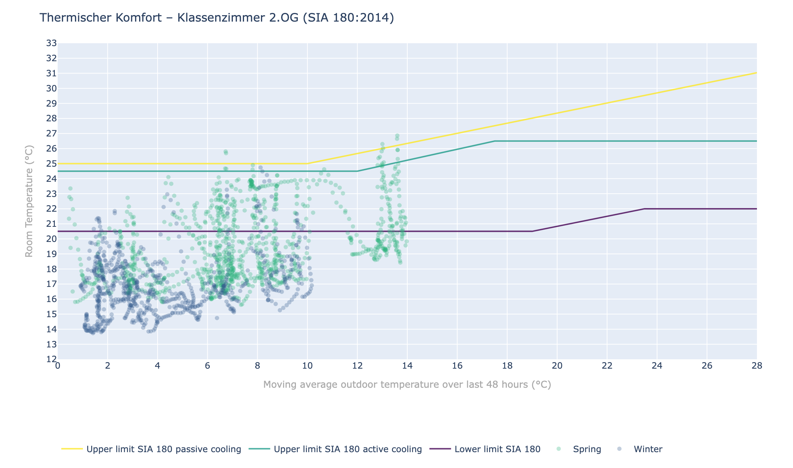

# SIA 180 Thermal Comfort

Interactive visualization of indoor thermal comfort according to the Swiss standard **SIA 180:2014**, implemented in Python with [Plotly](https://plotly.com/python/).

---

## What it does

The chart plots **room temperature** (y-axis) against the **48-hour rolling mean outdoor temperature** (x-axis) and overlays the three comfort zone boundaries defined in SIA 180:2014:

| Line | Description |
|------|-------------|
| **Lower limit** | Heating setpoint: 20.5 °C below 19 °C outdoor, rising to 22 °C at 23.5 °C outdoor |
| **Upper limit – active cooling** | 24.5 °C below 12 °C outdoor, rising to 26.5 °C at 17.5 °C outdoor (Fig. 4) |
| **Upper limit – passive cooling** | 25 °C below 10 °C outdoor, then 0.33 · T_outdoor + 21.8 °C (Fig. 3) |

Data points are coloured by season (Winter / Spring / Summer / Fall).

---

## Example



Open **index.html** in a browser for the interactive version.

[Demo Web-App](https://raffa3l.github.io/sia180-thermal-comfort/)

---

## Input data formats

### Room temperature – `Klassenzimmer-2.OG.csv`

Semicolon-separated with a header block. Data starts after the `*DATA` marker. Column order: `TIME ; RH ; T`

```
*DATA
2026-01-28 00:00:00.047;46.5;17.4
2026-01-28 00:05:00.047;46.5;17.4
```

### Outdoor temperature – `METEO-Aussentemperaturen.csv`

Semicolon-separated with 3 header rows. Date format: `"DD.DDMM.YY HH:MM"` (e.g. `"23.2301.26 14:00"` = 2026-01-23 14:00).

```
Name;"METEO - Air Temperature"
AKS;METEO:197:TT
Einheit;°C
"23.2301.26 00:00";-0.3
"23.2301.26 01:00";-0.4
```

---

## Installation

```bash
pip install -r requirements.txt
```

**Requirements:** Python ≥ 3.9, pandas ≥ 2.0, numpy ≥ 1.24, plotly ≥ 5.18

---

## Usage

### Run the included example

```bash
python example.py
```

This reads the sample data from `data/`, prints a summary, saves `example.html`, and opens the chart in your browser.

### Use in your own script

```python
from sia180_thermal_comfort import (
    parse_room_temp_csv,
    parse_outdoor_temp_csv,
    compute_comfort_data,
    plot_sia180,
)

df_room    = parse_room_temp_csv("data/Klassenzimmer-2.OG.csv")
df_outdoor = parse_outdoor_temp_csv("data/METEO-Aussentemperaturen.csv")

data = compute_comfort_data(df_room, df_outdoor)

fig = plot_sia180(data, title="My Room – SIA 180:2014")
fig.write_html("output.html", include_plotlyjs="cdn")
fig.show()
```

---

## Module reference

| Function | Description |
|----------|-------------|
| `parse_room_temp_csv(filepath)` | Parse Logger CSV → `DataFrame[time, temp_room]` |
| `parse_outdoor_temp_csv(filepath)` | Parse METEO CSV → `DataFrame[time, temp_outdoor]` |
| `compute_comfort_data(df_room, df_outdoor)` | Aggregate hourly, apply 48-h rolling mean, merge, assign seasons |
| `plot_sia180(data, title)` | Return interactive `plotly.graph_objects.Figure` |
| `get_season(month)` | Return `"Winter"` / `"Spring"` / `"Summer"` / `"Fall"` for a month number |

---

## Standards reference

- **SIA 180:2014** – Wärmeschutz, Feuchteschutz und Raumklima in Gebäuden  
  (Heat protection, moisture protection and indoor climate in buildings). Published by: [Schweizerischer Ingenieur- und Architektenverein (SIA)](https://www.sia.ch)
- Energy Data Analysis with R [hslu-ige-laes/edar](https://github.com/hslu-ige-laes/edar/blob/master/partDataVis/comfortSia180ThermCmf.Rmd).

---

## License

MIT
